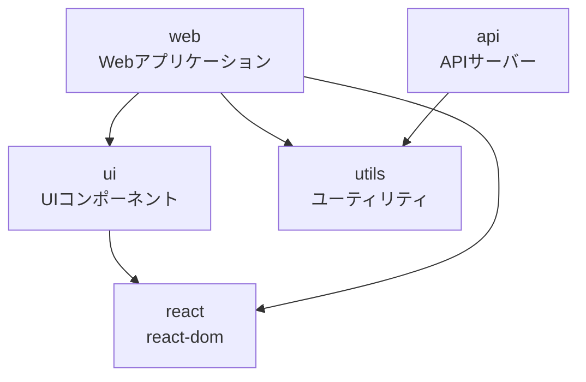

# Bun Workspace モノレポ

Bunのワークスペース機能を使用したモノレポのサンプルプロジェクトです。

## 🏗️ プロジェクト構成

```
.
├── packages/
│   ├── api/      # APIサーバー（ポート3001）
│   ├── web/      # Webアプリケーション
│   ├── ui/       # 共通UIコンポーネントライブラリ
│   └── utils/    # 共通ユーティリティ関数
├── package.json  # ワークスペース設定
├── bun.lock      # ロックファイル
├── bunfig.toml   # Bunの設定
├── tsconfig.json # TypeScript設定
└── biome.json    # コードフォーマッター設定
```

## 📦 パッケージ依存関係



### パッケージ詳細

| パッケージ | 説明 | 依存関係 |
|---------|------|---------|
| `@monorepo/web` | Reactベースのフロントエンドアプリケーション | `@monorepo/ui`, `@monorepo/utils`, `react`, `react-dom` |
| `@monorepo/api` | Bunで動作するAPIサーバー | `@monorepo/utils` |
| `@monorepo/ui` | 再利用可能なReactコンポーネントライブラリ | `react`, `react-dom` |
| `@monorepo/utils` | 共通ユーティリティ関数 | なし |

## 🚀 セットアップ

```bash
# 依存関係のインストール
bun install

# すべてのパッケージの開発サーバーを起動
bun dev

# 特定のパッケージのみ実行
bun run --filter @monorepo/web dev
bun run --filter @monorepo/api dev

# ビルド
bun build

# テスト
bun test

# 依存関係の更新
bun run update-deps
```

## 💡 ワークスペースの特徴

### 1. **自動的な依存関係解決**
`workspace:*` を使用することで、ローカルパッケージ間の依存関係を自動的に解決します。

```json
{
  "dependencies": {
    "@monorepo/utils": "workspace:*"
  }
}
```

### 2. **共通依存関係の一元管理**
ルートの `package.json` で共通の開発依存関係を管理し、重複を削減します。

### 3. **並列タスク実行**
`--filter` フラグを使用して、複数のパッケージのタスクを並列実行できます。

```bash
# すべてのパッケージでdevスクリプトを実行
bun run --filter '*' dev

# 特定のパッケージでビルド
bun run --filter @monorepo/api build
```

### 4. **TypeScript型の自動認識**
パッケージ間でTypeScriptの型定義が自動的に共有されます。

## 🛠️ 開発ツール

- **Bun** - JavaScriptランタイム & パッケージマネージャー
- **TypeScript** - 型安全な開発
- **Biome** - 高速なコードフォーマッター & リンター
- **React 19** - UIライブラリ（最新版）

## 📝 スクリプト

### ルートレベル
- `dev` - すべてのパッケージの開発サーバーを起動
- `build` - すべてのパッケージをビルド
- `test` - テストを実行
- `update-deps` - 依存関係を最新版に更新

### パッケージレベル
各パッケージには独自の `dev` と `build` スクリプトが定義されています。

## 🔧 設定ファイル

- `bunfig.toml` - Bunランタイムの設定
- `tsconfig.json` - TypeScriptコンパイラ設定
- `biome.json` - コードスタイルとフォーマット設定

## 📌 注意事項

- すべてのパッケージは ESModules (`"type": "module"`) を使用しています
- パッケージ間の循環依存を避けてください
- 新しいパッケージを追加する際は、`packages/` ディレクトリに配置してください