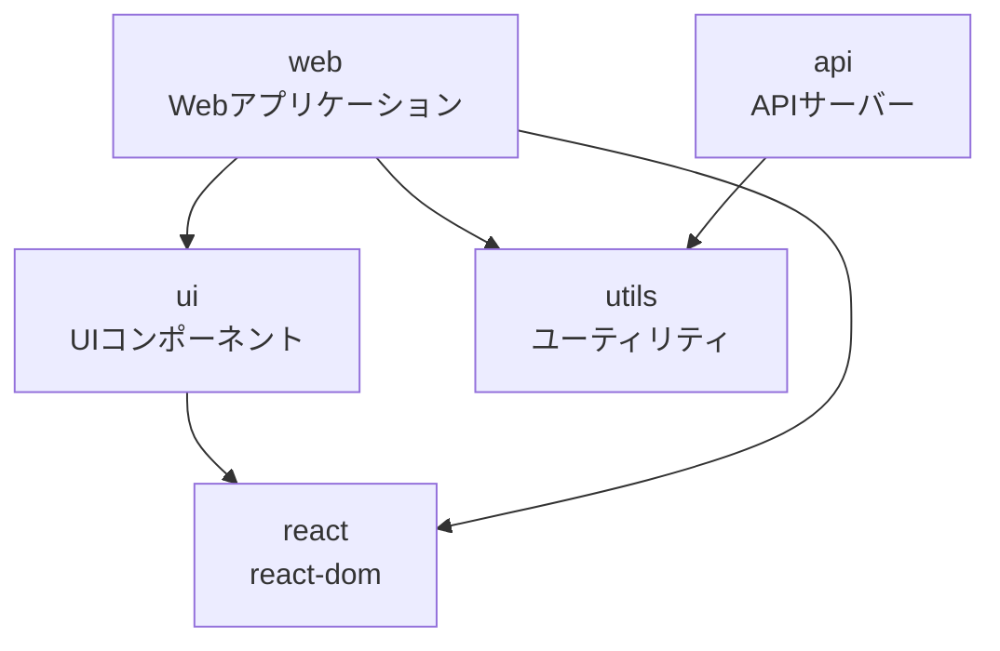

# Bun + Turborepo モノレポ

BunとTurborepoを組み合わせた高性能モノレポのサンプルプロジェクトです。

## 🏗️ プロジェクト構成

```
.
├── packages/
│   ├── api/      # APIサーバー（ポート3001）
│   ├── web/      # Webアプリケーション
│   ├── ui/       # 共通UIコンポーネントライブラリ
│   └── utils/    # 共通ユーティリティ関数
├── package.json  # ワークスペース設定
├── turbo.json    # Turborepo設定
├── bun.lock      # ロックファイル
├── bunfig.toml   # Bunの設定
├── tsconfig.json # TypeScript設定
└── biome.json    # コードフォーマッター設定
```

## 📦 パッケージ依存関係



### パッケージ詳細

| パッケージ | 説明 | 依存関係 |
|---------|------|---------|
| `@monorepo/web` | Reactベースのフロントエンドアプリケーション | `@monorepo/ui`, `@monorepo/utils`, `react`, `react-dom` |
| `@monorepo/api` | Bunで動作するAPIサーバー | `@monorepo/utils` |
| `@monorepo/ui` | 再利用可能なReactコンポーネントライブラリ | `react`, `react-dom` |
| `@monorepo/utils` | 共通ユーティリティ関数 | なし |

## 🚀 セットアップ

```bash
# 依存関係のインストール
bun install

# すべてのパッケージの開発サーバーを起動
bun dev  # または turbo run dev

# 特定のパッケージのみ実行
turbo run dev --filter=@monorepo/web
turbo run dev --filter=@monorepo/api

# ビルド
bun build  # または turbo run build

# テスト
bun test  # または turbo run test

# 依存関係の更新
bun run update-deps
```

## 🚄 Turborepoの特徴

### 1. **インテリジェントなキャッシュ**
Turborepoは、変更されていないタスクの結果をキャッシュし、再実行を回避します。

```bash
# 初回実行
turbo run build  # 全パッケージをビルド

# 2回目（変更なし）
turbo run build  # キャッシュから即座に復元
```

### 2. **並列実行の最適化**
依存関係グラフを理解し、可能な限り並列でタスクを実行します。

```bash
# utilsとuiを並列でビルド、その後webとapiを並列でビルド
turbo run build
```

### 3. **増分ビルド**
変更されたパッケージとその依存関係のみを再ビルドします。

```bash
# utilsを変更した場合
turbo run build --filter=...^utils
# utils、api、webのみ再ビルド（uiはスキップ）
```

### 4. **リモートキャッシュ（オプション）**
チーム間でビルドキャッシュを共有できます。

```bash
# リモートキャッシュの設定
turbo login
turbo link

# チームメンバー間でキャッシュ共有
turbo run build --team=myteam --token=$TURBO_TOKEN
```

## 💡 ワークスペースの特徴

### 1. **Bunの高速性**
- 依存関係のインストールが超高速
- TypeScriptのネイティブ実行
- ビルトインのテストランナー

### 2. **Turborepoの効率性**
- スマートなキャッシュシステム
- 最適化された並列実行
- CI/CDの大幅な高速化

### 3. **開発体験の向上**
```bash
# 変更監視と自動再起動
turbo run dev

# 影響を受けるパッケージのみテスト
turbo run test --filter=...[HEAD^]
```

## 🛠️ 開発ツール

- **Bun** - JavaScriptランタイム & パッケージマネージャー
- **Turborepo** - 高性能ビルドシステム
- **TypeScript** - 型安全な開発
- **Biome** - 高速なコードフォーマッター & リンター
- **React 19** - UIライブラリ（最新版）

## 📝 スクリプト

### ルートレベル
- `dev` - すべてのパッケージの開発サーバーを起動（Turbo経由）
- `build` - すべてのパッケージをビルド（キャッシュ付き）
- `test` - テストを実行（キャッシュ付き）
- `lint` - リントチェック（キャッシュ付き）
- `typecheck` - 型チェック（キャッシュ付き）
- `update-deps` - 依存関係を最新版に更新

### Turboコマンド例
```bash
# 特定パッケージのみビルド
turbo run build --filter=@monorepo/api

# 依存関係を含めてビルド
turbo run build --filter=...@monorepo/web

# 変更されたパッケージのみテスト
turbo run test --filter=[HEAD^]

# ドライラン（実行内容を確認）
turbo run build --dry-run
```

## 🔧 設定ファイル

- `turbo.json` - Turborepoパイプライン設定（詳細は[turbo.config.md](./turbo.config.md)参照）
- `bunfig.toml` - Bunランタイムの設定
- `tsconfig.json` - TypeScriptコンパイラ設定
- `biome.json` - コードスタイルとフォーマット設定

## 📌 注意事項

- すべてのパッケージは ESModules (`"type": "module"`) を使用しています
- パッケージ間の循環依存を避けてください
- 新しいパッケージを追加する際は、`packages/` ディレクトリに配置してください
- Turborepoのキャッシュは `.turbo` ディレクトリに保存されます（gitignore済み）